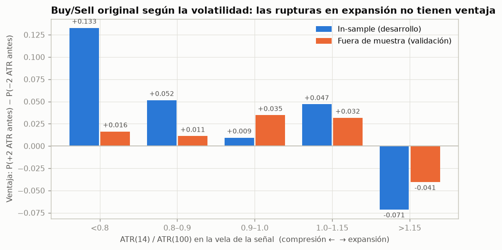
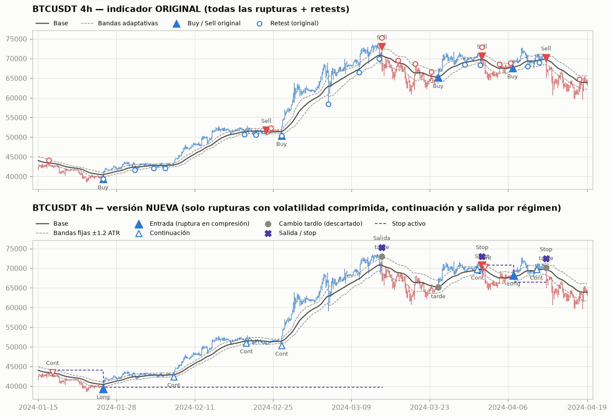
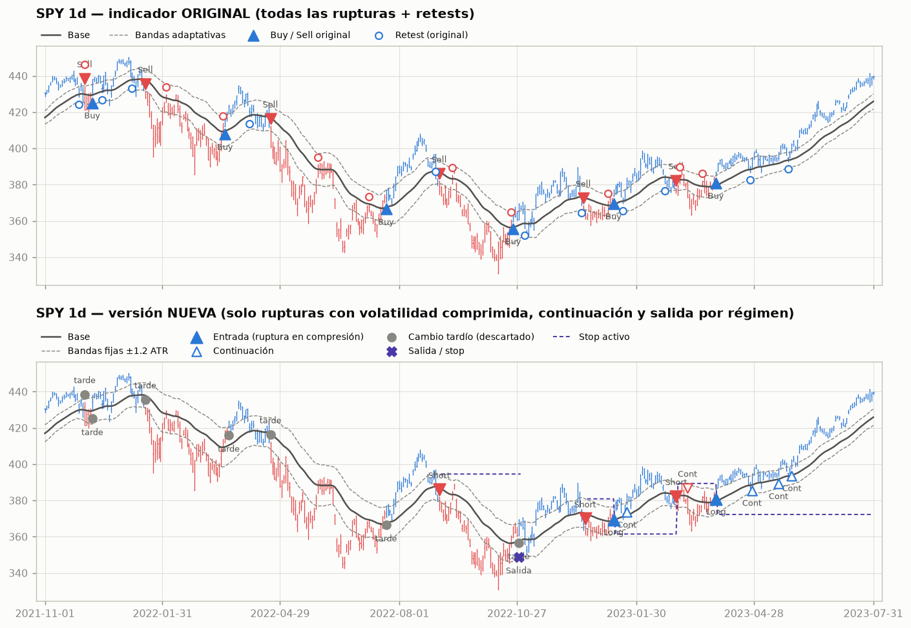
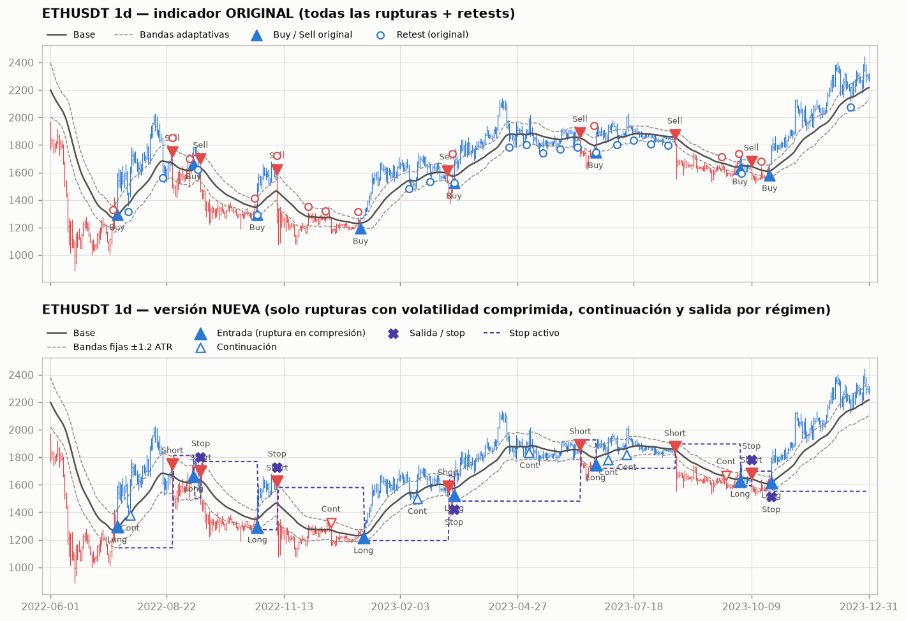
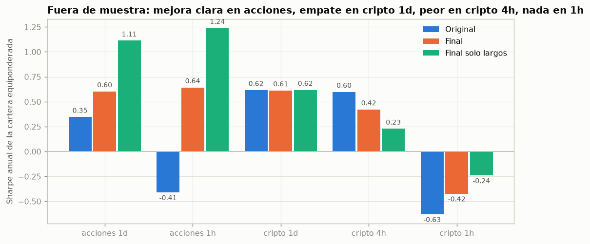

# Smart Money Flow Cloud [BOSWaves]: análisis, mejora de señales y validación

> Indicador original: `pine/00_original_smf_cloud.pine` (MPL 2.0, © BOSWaves).
> Versión mejorada: `pine/01_smf_cloud_senales_validadas.pine` (indicador) y `pine/02_smf_cloud_estrategia.pine` (strategy).
> Todo lo medido aquí se puede reproducir con el código de `research/` (ver `README.md`).

---

## Resumen ejecutivo

| Pregunta | Respuesta corta (con datos fuera de muestra) |
|---|---|
| 1. ¿Qué información útil contiene? | Un **régimen de tendencia**: precio frente a una EMA34 retrasada, con histéresis de ±mult·ATR. Aporta una persistencia de tendencia débil. También ofrece, sin usarlo, un **estado de volatilidad** (ATR). El *money flow*, la "nube" y los *retests* **no aportan información útil**. |
| 2. ¿Señales más tempranas sin más ruido? | **No con esta información.** Todas las variantes tempranas (cruce de base, giro de pendiente, giro del flujo, agotamiento) tuvieron ventaja nula o negativa, entre −0,12 y +0,01, tanto in-sample como fuera de muestra. Lo que sí funciona es **no entrar tarde**: descartar los cambios de régimen que ocurren con la volatilidad ya expandida. |
| 3. ¿Retroceso o reversión? | En la vela en que el precio toca la base, **ningún rasgo del indicador predice la dirección** (prueba con barreras simétricas). La aparente diferencia (cierre de nuevo por encima de la base → 54% de continuación vs 25%) es **geometría**, no predicción. La única frontera objetiva es la **banda contraria**: mientras no se cierre más allá de ella, es un retroceso; al cerrarla, la reversión está confirmada. |
| 4. ¿Final del pullback? | **No se detecta con fiabilidad.** Ninguna confirmación de "fin de pullback" superó a entrar al azar a favor del régimen; fuera de muestra todas fueron negativas. Solo acierta con ~20% de los finales de pullback reales. |
| 5. ¿Mejor entrada tras el pullback? | La **continuación**: tras un test de la base, esperar a que el cierre **vuelva a cruzar la banda del régimen** (con el filtro de volatilidad). Llega más tarde, pero es la única entrada relacionada con pullbacks con ventaja positiva y replicada. |
| 6. ¿Mejor salida? | El **cambio de régimen** (cierre más allá de la banda contraria), con un stop protector en esa banda al entrar. Toda salida más rápida (base, pendiente, chandelier 2–3 ATR, parciales) **redujo la expectativa** in-sample y fuera de muestra. |
| 7. ¿Qué eliminar o modificar? | Eliminar el *money flow* (banda adaptativa → banda fija), los *retest dots*, el *gauge* y la opción ALMA. Filtrar los Buy/Sell por volatilidad y añadir continuación, salida y stop. Mostrar las señales solo en velas cerradas. |
| 8. ¿Hay ventaja explotable? | **En acciones/ETF, solo largos: sí, modesta y consistente.** Sharpe fuera de muestra 1,11 en diario (t = 3,3) y 1,24 en 1h (solo 3 años de datos), drawdown −7% y −5%, pero muy por debajo de comprar y mantener en rentabilidad. **Cripto 1d/4h: débil** (el original y el mejorado se parecen, y en 4h ganó el original). **Cripto 1h: no**, la ventaja bruta ≈ costes. |

**Veredicto honesto:** el indicador es un seguidor de tendencia tipo Keltner con una capa cosmética de "smart money". Se puede **pulir**: filtrar las señales tardías, simplificar la banda, añadir continuación y una salida coherente. Eso mejora claramente los resultados en acciones y reduce el drawdown en todos los mercados. Pero **no se puede convertir en un detector temprano de reversiones o de finales de pullback**: la información para eso no está en sus cálculos.

---

## 0. Método

**Datos (68 series, velas cerradas, sin la última vela abierta)**
- Cripto (Binance spot, volumen real): BTC, ETH, BNB, SOL, XRP, ADA, DOGE, LINK, LTC, AVAX, DOT y TRX, en 1h, 4h y 1d (2017 → sept. 2026).
- Acciones/ETF/futuros diarios (Yahoo, ajustados): SPY, QQQ, IWM, DIA, EEM, GLD, TLT, XLE, XLF, XLK, AAPL, MSFT, NVDA, AMZN, GOOGL, META, TSLA, JPM, XOM, JNJ, GC=F y CL=F (desde 1962–2012 según el activo).
- Acciones/ETF en 1h (Yahoo, ~3 años): SPY, QQQ, IWM, GLD, AAPL, MSFT, NVDA, AMZN, TSLA y JPM.

**Partición.** Todas las decisiones de diseño se tomaron **solo con el tramo in-sample** (IS). El out-of-sample (OOS) se miró al final con el sistema congelado.

| Grupo | In-sample (desarrollo) | Out-of-sample (validación) |
|---|---|---|
| Cripto 1h / 4h / 1d | inicio → 31-dic-2021 | 2022 → sept. 2026 |
| Acciones 1d | inicio → 31-dic-2014 | 2015 → sept. 2026 |
| Acciones 1h | — | completo (2023–2026) |

Excepción documentada: tras ver el OOS comento que un umbral de volatilidad algo más laxo (1,1–1,2) se comporta mejor en cripto. **No** cambié el valor por defecto (1,0), que es el validado; lo dejo como recomendación marcada como "informada por el OOS".

**Port y verificación.** `research/smf.py` reproduce el indicador con la semántica de Pine: EMA con semilla SMA, ATR = RMA, `math.sum`, `crossover`, y el régimen con la misma inicialización. `research/pine_mirror.py` translitera línea a línea el Pine de la estrategia y genera **operaciones idénticas** (8/8 casos) a las del sistema validado (`research/system.py`).

**Verdad de campo (solo para evaluar; usa futuro a propósito).** Uso un zigzag en unidades de ATR. El nivel mayor (5 ATR) define los tramos de tendencia; sus pivotes son las **reversiones reales**. El nivel menor (2 ATR) marca los pivotes dentro de un tramo mayor, que son los **finales de pullback reales**.

**Métricas de señal (independientes de la salida).** Entrada en la apertura de la vela siguiente a la señal.
- **Ventaja** = P(tocar +2 ATR antes que −2 ATR) − P(al revés), en 40 velas. Un 0 equivale al azar. Es simétrica, así que no la contamina la geometría.
- Triple barrera asimétrica +3/−1,5 ATR (punto de equilibrio: 33,3%).
- Retraso desde el giro real, % del tramo ya recorrido al entrar, movimiento restante (ATR), % de señales falsas (en el tramo mayor contrario), cobertura de reversiones y de pullbacks.

**Backtest (`research/backtest.py`).** Replica `strategy()` de TradingView:
- Señal al cierre y ejecución en la apertura siguiente.
- Stop activo desde la vela de entrada; si hay gap, se ejecuta en la apertura.
- Regla de recorrido intrabarra de TradingView; trailing recalculado al cierre; giro con señal contraria.
- Costes por lado: **cripto 0,05% de comisión + 0,03% de slippage**; **acciones 0,01% + 0,02%**. Tiene pruebas unitarias en `research/tests/`.
- Tamaño: 100% del capital salvo que se indique otra cosa. Carteras equiponderadas por grupo, con rebalanceo diario.

**Sesgos que hay que tener presentes**
1. Las acciones elegidas son ganadoras conocidas hoy (NVDA, TSLA, META…). Ese sesgo de supervivencia infla sobre todo "comprar y mantener".
2. Probé muchas variantes, así que un t≈2 es evidencia débil.
3. Los datos de Binance/Yahoo no son idénticos a los de TradingView.

---

## 1. Qué hace realmente el indicador original

### 1.1 Cálculos

| Componente | Fórmula | Lectura |
|---|---|---|
| Base | `bC = EMA3(EMA34(close))`, `bO = EMA3(EMA34(open))` | Retraso ≈ 17,5 velas en tendencia. |
| "Nube" | `bC − bO = EMA3(EMA34(close − open))` | En mercados 24/7 (open = close anterior) es **exactamente la pendiente** de la base: correlación **1,000** en las 36 series cripto; 0,66–0,72 en acciones (los gaps la separan). No aporta información nueva. |
| Money flow | `CLV = ((c−l)−(h−c))/(h−l)`; `mf = Σ(CLV·vol) / Σ abs(CLV·vol)` (24 velas), EMA5 | Presión compradora/vendedora normalizada en [−1, 1]. |
| Multiplicador | `mult = 0,9 + 1,3·abs(mf)^1,2` | **Solo usa el valor absoluto**: un flujo fuerte en cualquier dirección ensancha **las dos** bandas por igual. El signo se descarta. Mediana real 1,03–1,07, p95 1,40–1,48, máximo observado < 2,0 (**2,2 nunca se alcanza**). Con volumen 0 (p. ej. FX en Yahoo) la banda queda fija en 0,9. |
| Bandas | `bC ± ATR14·mult` | Canal tipo Keltner. |
| Régimen | pasa a +1 cuando el cierre cruza la banda superior y a −1 cuando cruza la inferior | Histéresis sobre el oscilador implícito **z = (close − base)/ATR** con umbrales ±mult. |
| Buy/Sell | cambio de régimen | Un cambio cada 35–46 velas según el grupo. |
| Retest dots | primer toque de la base contra el régimen, con 12 velas de enfriamiento | Idea de "pullback". |
| Gauge | `EMA3(tanh(1,5·z/mult))` en una tabla | Cosmético: es z comprimido. |

Consecuencia: todo el sistema de señales es **una histéresis sobre z**. El "smart money flow" solo modula un poco el ancho de la histéresis, y en la dirección contraria a la intuición. Con un flujo alcista fuerte, la banda superior se **aleja** y el Buy llega **más tarde**.

### 1.2 Repintado, lookahead y uso de información futura

- **Sin lookahead**: no hay `request.security`, desplazamientos negativos ni `offset`. El `offset` de ALMA pondera la ventana pasada; no mira al futuro.
- **Sin repintado histórico**: una vez cerrada la vela, la señal no cambia.
- **Sí hay señales intrabarra en tiempo real**: los cálculos usan el `close` de la vela en curso, así que un Buy/Sell o un *dot* puede aparecer y desaparecer antes del cierre. Con alertas "Una vez por vela" dispara avisos que luego no existen. Hay que usar "Una vez por cierre de vela". La versión nueva añade la opción *Solo velas cerradas* (activada por defecto).
- **Patrón frágil**: `tState pst = st[1]` sobre un objeto `var`. `st[1]` apunta **al mismo objeto**, así que `pst.lastSignal` solo vale "el anterior" porque se lee antes de escribirse. Funciona, pero de casualidad.
- Si el símbolo no tiene volumen (`na`), `math.sum` devuelve `na`, las bandas desaparecen y **no hay ninguna señal**.
- El calentamiento requiere ≈ 300 velas; las primeras señales no son fiables.

### 1.3 Diagnóstico cuantitativo de las señales originales

Agregado de todos los grupos:

| Señal original | Ventaja IS | Ventaja OOS | % del tramo ya recorrido al entrar | Restante (ATR) | Falsas (tramo contrario) | Reversiones detectadas tarde (>50%) o nunca |
|---|---|---|---|---|---|---|
| Buy/Sell | +0,038 | +0,012 | 49% / 51% | 5,7 / 5,2 | 26% / 25% | 52% / 53% |
| Retest dots | +0,014 | **−0,011** | 46% / 47% | 7,1 / 6,6 | **47% / 48%** | — |
| *Referencia: entrada aleatoria a favor del régimen* | +0,025 | +0,006 | 55% / 58% | 6,1 / 5,7 | 34% / 34% | — |

- **Buy/Sell** apenas mejora a una entrada aleatoria dentro del régimen. **La mitad del movimiento ya ocurrió** cuando aparece, y la mitad de las reversiones reales se detectan tarde o nunca.
- **Retest dots**: casi la mitad aparecen cuando el mercado ya está girando (el "pullback" era una reversión). Fuera de muestra tienen ventaja negativa. Detectan solo el 18% de los finales de pullback reales, con una precisión del 20%.

Funciona mejor en tendencias limpias y largas (cripto 2017–2021: cripto 4h IS con PF en ATR de 1,97). Genera ruido en rangos: compra en máximos y vende en mínimos del rango, y el *whipsaw* es el caso típico. Además llega tarde sobre todo **tras una expansión de volatilidad** (ver 3.3).

---

## 2. Reversión vs pullback vs continuación

### 2.1 El evento clave: el precio vuelve a la base

Definí un **test de base**: dentro de un régimen, la primera vela de cada episodio en que el precio toca la base (24.871 eventos IS y 37.472 OOS). En retrospectiva:
- **Continuación**: el precio marca un nuevo extremo antes de que el régimen cambie.
- **Reversión**: el régimen cambia primero.

**Solo el 38,6% termina en continuación** (IS; 37,6% OOS). Por eso los *retest dots* fallan: disparan en un evento que mayoritariamente es reversión.

### 2.2 La trampa: rasgos que "separan" pero no predicen

Probabilidad de continuación por quintiles, con la ventaja justa (±2 ATR) en el mismo evento:

| Rasgo en la vela del toque | P(continuación) por quintil, IS | Ventaja ±2 ATR por quintil, IS | Ventaja ±2 ATR por quintil, OOS |
|---|---|---|---|
| Cierre respecto a la base (rechazo) | 25,0 · 33,7 · 38,3 · 42,2 · **53,9%** | −0,018 · 0,000 · +0,038 · 0,000 · +0,020 | −0,009 · −0,011 · −0,033 · −0,020 · −0,028 |
| Cuerpo de la vela | 29,7 · 35,7 · 37,2 · 39,3 · **51,1%** | −0,010 · +0,017 · +0,009 · −0,005 · +0,028 | −0,004 · −0,015 · −0,026 · −0,017 · −0,038 |
| Pendiente de la base | 27,9 · 35,6 · 38,7 · 42,8 · **48,2%** | −0,014 · +0,009 · +0,004 · +0,028 · +0,013 | −0,024 · −0,017 · −0,028 · −0,029 · −0,002 |
| Money flow a favor | 36,9 · 37,4 · 37,8 · 39,0 · 42,0% | +0,031 · −0,005 · −0,007 · 0,000 · +0,021 | −0,026 · −0,041 · −0,016 · −0,009 · −0,009 |
| Nº de test en el régimen (1º → 3º+) | 42,5 · 43,2 · 37,4 · 36,2 · 33,8% | +0,043 · +0,044 · +0,009 · −0,006 · −0,051 | −0,001 · −0,008 · −0,010 · −0,026 · −0,056 |

La separación en "P(continuación)" es real (y se repite OOS: 24,8% → 53,5% para el cierre), pero **mecánica**. Si la vela cerró por encima de la base, el máximo previo está más cerca y la banda contraria más lejos. Con barreras simétricas desde la entrada, la ventaja es **plana** in-sample (−0,02 a +0,04, sin monotonía) y **negativa en todos los quintiles** fuera de muestra. En 2D (pendiente × cierre), la pendiente no añade nada una vez conocido el cierre. **Conclusión: en el toque, este indicador no sabe si es retroceso o reversión.** El único rasgo con efecto monótono en ambos periodos es el **orden del test**: el primer y segundo test son mejores que el tercero y siguientes. Pero incluso los primeros quedan en ≈ 0 fuera de muestra: es un efecto relativo, no una ventaja.

### 2.3 Qué sí distingue retroceso de reversión

1. **El nivel de invalidación.** Mientras el cierre no supere la banda contraria (≈ 1,2 ATR al otro lado de la base), el movimiento se trata como retroceso; al superarla, la reversión está confirmada. No es predicción: es **gestión**. Define dónde se equivoca la tesis y por eso es el stop natural.
2. **La reanudación.** El final del pullback se confirma cuando la tendencia **se reanuda**: el cierre vuelve a cruzar la banda del régimen tras el test. Esta **continuación** es la única señal ligada a pullbacks con ventaja positiva replicada (IS +0,052, OOS +0,029).
3. **La volatilidad**, para los cambios de régimen (sección 3.3).

---

## 3. Entradas: rapidez frente a calidad

### 3.1 Todas las variantes (agregado, ventaja ±2 ATR/40 velas)

| Familia | Variante | Ventaja IS | Ventaja OOS | % tramo recorrido (OOS) | Falsas (OOS) |
|---|---|---|---|---|---|
| **Reversión** | R0 cruce de banda (original) | +0,038 | +0,012 | 51% | 25% |
| | R1 primer cruce de la base | −0,030 | +0,003 | 40% | 44% |
| | R2 giro de pendiente | −0,017 | +0,010 | 42% | 40% |
| | R4 giro del money flow | −0,011 | −0,023 | 33% | 56% |
| | R5 agotamiento (z ≤ −2 + cierre > máx. anterior) | **−0,120** | **−0,046** | 23% | 67% |
| **Fin de pullback** | toque inmediato | +0,018 | −0,012 | 49% | 46% |
| | +1 vela: z sube | +0,012 | −0,013 | 50% | 42% |
| | cierre > máximo anterior | +0,011 | −0,012 | 51% | 38% |
| | recuperación de la base | +0,023 | −0,009 | 50% | 41% |
| | cierre > máx. de 2 velas | +0,015 | −0,008 | 52% | 35% |
| | + pendiente a favor | +0,019 | −0,010 | 51% | 39% |
| | + flujo a favor | +0,006 | −0,014 | 50% | 42% |
| **Continuación** | re-cruce de banda tras test | **+0,052** | **+0,029** | 59% | 27% |
| | nuevo extremo tras test | **+0,062** | **+0,045** | 65% | 13% |
| Referencia | aleatoria a favor del régimen | +0,025 | +0,006 | 58% | 34% |

Lectura:
- **Entrar antes cuesta más de lo que aporta.** Las reversiones tempranas entran con el 23–42% del tramo recorrido, frente al 51% del original, pero se equivocan de tramo el 40–67% de las veces y su ventaja es nula o negativa (IS −0,12 a −0,01; OOS −0,05 a +0,01). El "agotamiento" (comprar el cuchillo que cae) es claramente negativo: a estos horizontes, los extremos continúan.
- **El fin de pullback no supera al azar.** Cada nivel extra de confirmación reduce las falsas (46% → 35%), pero retrasa la entrada y deja la ventaja igual: in-sample por debajo del azar a favor del régimen, fuera de muestra negativa. Detectan solo el 8–20% de los finales de pullback reales, con una precisión del 26–39%.
- **La continuación es tardía pero buena.** Es la única familia claramente por encima de la referencia en IS y OOS.
- A nivel de operaciones con la misma salida (IS), en acciones y en cripto 1h/4h las entradas quedan por debajo del Buy/Sell original: fin de pullback, 0,18/0,32/0,92 ATR por operación frente a 0,25/0,48/1,27; reversión temprana, **negativa en cripto 1h**, con 0–8% de datasets rentables. En cripto 1d (9 datasets) el fin de pullback empató con el original.

### 3.2 La mínima confirmación útil

Señal → pequeña confirmación → entrada:
- Para las **rupturas**, la confirmación útil no es otra vela ni otro indicador, sino una comprobación del **contexto de volatilidad** en la misma vela. No añade retraso.
- Para el **pullback**, esperar confirmaciones de vela no mejora nada. La confirmación que sí aporta es la **reanudación** (re-cruce de la banda). Añade retraso, pero es la única con ventaja.

### 3.3 El hallazgo principal: los cambios de régimen tardíos

La ventaja del Buy/Sell original depende del ratio **ATR(14)/ATR(100)** en la vela de la señal:

| ATR14/ATR100 | < 0,8 | 0,8–0,9 | 0,9–1,0 | 1,0–1,15 | **> 1,15** |
|---|---|---|---|---|---|
| Ventaja IS | +0,133 | +0,052 | +0,009 | +0,047 | **−0,071** |
| Ventaja OOS | +0,016 | +0,011 | +0,035 | +0,032 | **−0,041** |

- **Robusto (IS y OOS):** los cambios de régimen con la volatilidad **ya expandida** no tienen ventaja. Llegan con el 53–54% del tramo hecho y solo 4,2–4,3 ATR restantes (frente a 5,8–6,5 de los aceptados). Son literalmente "las señales que aparecen cuando el movimiento ya ocurrió".
- **No robusto:** que la compresión fuerte (< 0,8) sea excelente. Fue +0,133 in-sample y solo +0,016 fuera de muestra.
- En entradas aleatorias este efecto **no aparece**: no es un artefacto de la métrica.
- In-sample, el filtro formó una **meseta amplia**: todas las combinaciones de ATR largo 100–200 y umbral 0,8–1,2 superan a "sin filtro" en todos los grupos. No hay un pico aislado.

### 3.4 Otras hipótesis descartadas (IS, a nivel de operaciones)

| Idea | Resultado | Decisión |
|---|---|---|
| Filtro de money flow a favor | mejora el resultado por operación, pero elimina la mitad de las operaciones y **baja el total** en todos los grupos | eliminar |
| Bandas asimétricas por el **signo** del flujo | acciones algo mejor, cripto 1h peor (3.605 → 3.159–3.446 ATR) | eliminar |
| Banda adaptativa original vs fija 1,2 | la fija es igual o mejor en todos los grupos (y mejor por operación en los 5 grupos OOS) | banda fija |
| Añadir fin de pullback a ruptura + continuación | total igual, más operaciones y peor calidad | no añadir |
| Añadir continuación a la ruptura | total mayor en todos los grupos IS y en 4 de 5 grupos OOS (el quinto, igual) | **añadir** |

---

## 4. Salidas (estudiadas por separado, con la misma entrada)

Entrada fija: ruptura en compresión + continuación, banda 1,2. Resultado medio por operación en ATR, después de costes:

| Salida | Acc. 1d IS / OOS | Acc. 1h OOS | Cripto 1d OOS | Cripto 4h IS / OOS | Cripto 1h IS / OOS |
|---|---|---|---|---|---|
| **Cambio de régimen (banda contraria)** | **0,65 / 0,51** | 0,12 | **1,49** | **1,71 / 0,47** | **0,71 / 0,04** |
| Stop inicial 2 ATR + régimen | 0,63 / 0,52 | 0,03 | 1,40 | 1,40 / 0,42 | 0,62 / 0,02 |
| Stop que sigue a la banda contraria | 0,56 / 0,54 | 0,04 | 1,28 | 1,40 / 0,37 | 0,46 / −0,02 |
| Pendiente de la base gira | 0,45 / 0,45 | 0,05 | 1,12 | 1,29 / 0,42 | 0,33 / −0,06 |
| Cierre cruza la base | 0,34 / 0,35 | 0,01 | 1,01 | 0,96 / 0,35 | 0,25 / −0,10 |
| Chandelier 4 ATR | 0,41 / 0,56 | 0,07 | 0,99 | 1,18 / 0,39 | 0,39 / −0,03 |
| Chandelier 3 ATR | 0,26 / 0,33 | 0,12 | 0,38 | 0,57 / 0,24 | 0,22 / −0,08 |
| Chandelier 2 ATR | 0,13 / 0,11 | −0,02 | 0,35 | 0,22 / 0,12 | 0,02 / −0,15 |
| Parcial 50% a 2 ATR + BE + chandelier 3 | 0,20 / 0,15 | 0,06 | 0,29 | 0,29 / 0,14 | 0,08 / −0,13 |
| Tiempo (40 velas) | 0,40 / 0,46 | 0,13 | 0,98 | 0,91 / 0,37 | 0,42 / −0,09 |

- La ventaja de un seguidor de tendencia vive en **pocas operaciones grandes**: la tasa de acierto es del 30–40% y la ganancia media es 2,3–3,4 veces la pérdida media. Cualquier salida que recorte la cola derecha la destruye. La toma parcial sube el acierto al 50%, pero casi anula el beneficio.
- Las señales de "reversión temprana" (base, pendiente) **tampoco sirven como salida**.
- **Stop inicial:** con la banda contraria al entrar (≥ 2,4 ATR en una ruptura) o con 3 ATR, la expectativa es prácticamente la misma que sin stop; protege frente a velas extremas sin coste. Con 2 ATR cuesta poco; con 1,5 ATR ya perjudica. Es una zona plana de 2,4 a 3 ATR.
- Tomas parciales lejanas (4–6 ATR): bajan la expectativa un 15–40% a cambio de menos drawdown. Es una preferencia de riesgo, no una mejora.
- **Tamaño por riesgo** (arriesgar un 1% del capital hasta el stop): el drawdown OOS baja de −40/−70% a −2/−9% (−21% en cripto 1h), y el Sharpe OOS sube en cripto (4h: 0,42 → 0,79; 1d: 0,61 → 0,80). Es un efecto de **dimensionamiento**, no de la señal.

---

## 5. La versión mejorada

### 5.1 Qué se eliminó, qué se modificó y por qué

| Elemento original | Decisión | Evidencia |
|---|---|---|
| Banda adaptativa por \|money flow\| | → **banda fija 1,2·ATR** (la adaptativa queda como opción para comparar) | La fija es igual o mejor; el flujo no aporta como ancho, filtro ni asimetría |
| Money flow en general | eliminado de la lógica | §3.4 |
| Retest dots con enfriamiento de 12 velas | eliminados → marcador de **pullback** (test de base) solo descriptivo | Ventaja negativa OOS, 48% en el tramo equivocado |
| Gauge de fuerza | eliminado → **panel de estado** (régimen, volatilidad, posición, stop) | Era z comprimido |
| ALMA | eliminado (simplificación) | No aportaba una idea distinta |
| Buy/Sell en cualquier contexto | → **Entrada** solo si ATR14/ATR100 < umbral; si no, marcador gris "**tarde**" | §3.3 |
| — | **Continuación** tras test de base | §2.3 y §3.4 |
| — | **Salida** por cambio de régimen y **stop** en la banda contraria | §4 |
| Señales intrabarra | opción *Solo velas cerradas* (por defecto) | §1.2 |
| Reversión temprana y "fin de pullback" | **no se incluyen** | Sin ventaja sobre entrar al azar en el régimen (IS) y nula o negativa (OOS) |

### 5.2 Qué muestra el indicador (`01_smf_cloud_senales_validadas.pine`)

- **Long / Short**: cambio de régimen con la volatilidad no expandida (entrada).
- **Cont**: continuación tras pullback (re-entrada a favor del régimen).
- **tarde** (gris): cambio de régimen con la volatilidad expandida. **No es entrada**, pero sí cierra la posición contraria.
- **◆** Pullback: primer test de la base en el régimen. Es un estado, no una entrada.
- **Salida / Stop** y la línea del **stop activo** de una posición conceptual idéntica a la de la strategy.
- Nube (base), bandas, velas por régimen, zonas de compresión (opcional), panel de estado y 7 alertas.

Posible reversión y fin probable del pullback: **no se muestran a propósito**. Se midieron y no aportan (sección 3.1). Mostrarlas sería añadir "señales artificiales".

### 5.3 Estrategia (`02_smf_cloud_estrategia.pine`)

- **Largos y cortos**, o solo uno de los dos.
- Entradas por **ruptura** y **continuación**, con el filtro de compresión.
- **Stop inicial**: banda contraria al entrar, ATR × k o ninguno.
- **Salida**: cambio de régimen, régimen + cruce de base, o régimen + chandelier; stop temporal opcional.
- **Tamaño**: % del capital, **riesgo % hasta el stop** o cantidad fija.
- **Rango de fechas** configurable.
- **Comisión y slippage** en la pestaña *Propiedades* (por defecto 0,05% y 1 tick).
- `margin_long/short = 0`, sin apalancamiento, para que no aparezcan *margin calls* artificiales en cortos al 100%.

Verificación: la transliteración del Pine a Python produce **las mismas operaciones** que el sistema validado (8/8 casos).

### 5.4 Así se ve

En SPY 2022 (arriba) el original encadena Buy/Sell con *whipsaw* durante la caída; el nuevo marca esos cambios como "tarde" y solo toma el corto de agosto, en compresión. En ETH 2022–2023 (rango lateral con poca volatilidad) el nuevo **también** sufre *whipsaws*: el filtro no arregla los rangos, y el empate en cripto 1d lo refleja.

---

## 6. Resultados de la estrategia

Configuración validada (congelada con IS): banda fija 1,2; filtro 1,0 (ATR100); ruptura + continuación; salida por régimen; stop en la banda contraria; 100% del capital; costes indicados en §0.

### 6.1 Escalera de mejoras, por operación (OOS)

| Grupo (OOS) | Config. | Operaciones | Acierto | PF | Expectativa (% por op.) | Ganancia media | Pérdida media | Duración (velas) |
|---|---|---|---|---|---|---|---|---|
| Acciones 1d | Original | 1.884 | 32,8% | 1,24 | +0,71% | +11,4% | −4,5% | 34 |
| | **Final** | 910 | 33,7% | 1,46 | +1,19% | +11,2% | −3,9% | 36 |
| | **Final solo largos** | 500 | 40,6% | **2,65** | **+3,49%** | +13,8% | −3,6% | 44 |
| Acciones 1h | Original | 1.349 | 32,4% | **0,91** | −0,13% | +3,8% | −2,0% | 35 |
| | **Final** | 640 | 30,6% | 1,22 | +0,24% | +4,3% | −1,6% | 35 |
| | **Final solo largos** | 327 | 35,8% | **1,74** | +0,73% | +4,8% | −1,5% | 41 |
| Cripto 1d | Original | 509 | 36,9% | 1,45 | +3,18% | +27,6% | −11,1% | 40 |
| | **Final** | 396 | 34,6% | 1,62 | +4,43% | +33,3% | −10,9% | 41 |
| Cripto 4h | Original | 3.124 | 33,6% | **1,20** | +0,57% | +10,3% | −4,4% | 40 |
| | **Final** | 2.195 | 33,1% | 1,13 | +0,35% | +9,4% | −4,1% | 41 |
| Cripto 1h | Original | 12.768 | 30,7% | 0,91 | −0,15% | +4,8% | −2,4% | 39 |
| | **Final** | 8.222 | 28,6% | 0,92 | −0,12% | +4,9% | −2,1% | 39 |

PF = suma de retornos de las ganadoras / suma de las perdedoras. En 1h, una vela es una hora y en 1d, un día.

### 6.2 Cartera equiponderada por grupo: CAGR / drawdown máximo / Sharpe

| Grupo | Periodo | Original | Final | Final solo largos | Comprar y mantener* |
|---|---|---|---|---|---|
| Acciones 1d | IS | 1,6% / −56% / 0,18 | 3,2% / −36% / 0,36 | 5,4% / −21% / 0,67 | 17,4% / −45% / 0,89 |
| | **OOS** | 3,5% / −17% / 0,35 | 3,4% / **−9,7%** / **0,60** | 5,9% / **−7,4%** / **1,11** | 20,5% / −32% / 1,17 |
| Acciones 1h | **OOS** | **−6,4%** / −25% / −0,41 | 5,6% / −11% / 0,64 | 8,6% / −4,9% / **1,24** | 29,1% / −23% / 1,37 |
| Cripto 1d | IS | 164% / −42% / 1,76 | 135% / −34% / 1,80 | 134% / −33% / 1,84 | 120% / −73% / 1,32 |
| | **OOS** | 18,4% / −44% / 0,62 | 17,3% / −40% / 0,61 | 16,2% / −39% / 0,62 | −1,5% / −71% / 0,30 |
| Cripto 4h | IS | 109% / −41% / 1,46 | 128% / −34% / 1,74 | 115% / −33% / 1,83 | 172% / −85% / 1,54 |
| | **OOS** | **18,4%** / −47% / **0,60** | 9,0% / −42% / 0,42 | 2,5% / −43% / 0,23 | −1,9% / −71% / 0,29 |
| Cripto 1h | IS | 64% / −42% / 1,03 | 134% / −31% / 1,71 | 95% / −35% / 1,67 | 156% / −87% / 1,47 |
| | **OOS** | **−35%** / −90% / −0,63 | **−20%** / −70% / −0,42 | −9,4% / −50% / −0,24 | −1,9% / −71% / 0,29 |

\*Comprar y mantener de las mismas acciones está muy inflado por el sesgo de supervivencia.

### 6.3 Resultados por año (OOS, cartera del grupo; final vs original)

| Año | Acciones 1d | Acciones 1h | Cripto 1d | Cripto 4h | Cripto 1h |
|---|---|---|---|---|---|
| 2015 | −3,9% vs −8,3% | | | | |
| 2016 | −3,1% vs +7,9% | | | | |
| 2017 | +11,1% vs +8,4% | | | | |
| 2018 | +0,9% vs −3,0% | | | | |
| 2019 | +3,4% vs +2,9% | | | | |
| 2020 | +7,5% vs +25,9% | | | | |
| 2021 | +4,7% vs +4,1% | | | | |
| 2022 | +0,1% vs +1,0% | | −12,5% vs −13,6% | +1,6% vs +32,7% | −29,1% vs −48,3% |
| 2023 | +6,3% vs +6,7% | | +43,2% vs +70,8% | +48,9% vs +34,0% | −16,8% vs −46,6% |
| 2024 | +2,1% vs −3,6% | +7,3% vs −5,3% | +39,0% vs +27,0% | +34,5% vs +69,2% | −10,7% vs +17,4% |
| 2025 | +7,9% vs +3,6% | +7,3% vs −10,6% | −3,7% vs −8,8% | −11,3% vs −13,6% | −23,4% vs −51,6% |
| 2026 (a sept.) | +3,6% vs −1,4% | +0,8% vs −1,6% | +27,1% vs +30,1% | −16,7% vs −14,5% | −11,9% vs −17,4% |

En acciones 1d el final es más estable, con menos años negativos y peores, pero pierde los años de grandes tendencias en volatilidad alta (2020: +7,5% vs +25,9%): es el precio de filtrar las rupturas en expansión.

### 6.4 Costes y significancia

- **Costes ×2** (OOS, Sharpe original → final): acciones 1d 0,31 → 0,57 (solo largos 1,09); acciones 1h −0,62 → 0,49 (solo largos 1,13); cripto 1d 0,58 → 0,58; cripto 4h 0,41 → 0,24; cripto 1h −1,32 → −1,04.
- **Cripto 1h sin costes**: +0,23 a +0,32 ATR por operación. Con los costes reales se evapora: la ventaja bruta ≈ los costes. No es operable con comisiones *taker*.
- **t-stat de la expectativa por operación**, agregada por mes para no inflarla por la correlación entre activos:

| Grupo | IS original / final / final solo largos | OOS original / final / final solo largos |
|---|---|---|
| Acciones 1d | 2,5 / 3,6 / 4,9 | 1,1 / **2,3** / **3,3** |
| Acciones 1h | — | −0,1 / 0,9 / 1,7 |
| Cripto 1d | 1,1 / 1,2 / 1,2 | 2,2 / 2,4 / 2,0 |
| Cripto 4h | 3,3 / 3,1 / 3,3 | 2,7 / 2,1 / 1,8 |
| Cripto 1h | 5,2 / 5,1 / 3,5 | 0,9 / 0,8 / 0,8 |

Tras probar muchas variantes, solo los t ≳ 2,5 son convincentes: la mejora en acciones diarias, sobre todo solo largos (t = 3,3 OOS). Acciones 1h va en la misma dirección, pero con solo 3 años de datos (t = 1,7). En cripto 1h la significancia in-sample (t = 5) **desapareció por completo** fuera de muestra. La persistencia de tendencia de cripto 2017–2021 no se repitió en 2022–2026 a estos horizontes (entradas aleatorias a favor del régimen: +0,02/+0,09 IS → +0,005/−0,016 OOS).

---

## 7. Robustez (no sobreoptimización)

- **Multiplicador × longitud de la base** (0,8–2,0 × 21/34/55): IS, las 15 combinaciones son rentables en todos los grupos y varían de forma suave. Bandas más anchas o bases más largas dan menos operaciones y de más ATR cada una. OOS se mantiene sin precipicios en acciones 1d, cripto 1d y 4h. En cripto 1h está cerca de 0 en todas. **Rapidez vs calidad:** con la banda 1,5 la ruptura entra algo más tarde (54% del tramo frente a 51% OOS), con menos falsas (21–22% frente a 26%) y más ventaja (IS +0,090 frente a +0,071). Por defecto se deja 1,2, que es más rápida y está dentro de la meseta; 1,5 es la alternativa conservadora.
- **Filtro de volatilidad** (ATR largo 50/100/200 × umbral 0,8–1,2): IS, todo supera a "sin filtro". OOS, en acciones 1d y 1h y en cripto 1d casi todo sigue superándolo. En cripto 4h, 1,0 recorta demasiadas operaciones y 1,15–1,2 recupera el total del original con mejor calidad por operación. **Recomendación (informada por el OOS):** 1,0 para acciones y 1,1–1,2 para cripto.
- **ATR corto** 7–28: todo similar. Se deja el 14 original.
- Ningún parámetro del sistema final está en un pico aislado. Los que tienen efecto (umbral y ancho de banda) se comportan como diales suaves de selectividad.

---

## 8. Métricas de señal pedidas (agregado; IS / OOS)

| Métrica | Buy/Sell original | Retest dots | **Entrada nueva** | **Continuación nueva** |
|---|---|---|---|---|
| Retraso desde el giro real (mediana, velas; primera señal tras el pivote mayor) | 16 / 14 | 22 / 21 | 23 / 21 | 49 / 49 |
| Retraso desde el inicio del tramo (señales a favor del tramo) | 22 / 21 | 51 / 48 | 32 / 28 | 68 / 66 |
| % del tramo ya recorrido al entrar | 49% / 51% | 46% / 47% | 48% / 51% | 58% / 61% |
| Movimiento restante tras la entrada (ATR, mediana) | 5,7 / 5,2 | 7,1 / 6,6 | 6,5 / 5,8 | 6,5 / 5,8 |
| Señales falsas (en el tramo mayor contrario) | 26% / 25% | 47% / 48% | 26% / 26% | 24% / 25% |
| Ventaja ±2 ATR | +0,038 / +0,012 | +0,014 / −0,011 | +0,071 / +0,023 | +0,071 / +0,035 |
| Pullbacks reales identificados (recall / precisión, OOS) | — | 18% / 20% | — | 3% / 51%* |
| Retrocesos confundidos con reversión (señales de giro dentro de una tendencia que continuó) | 26% / 25% | — | 26% / 26% | — |
| Reversiones reales detectadas tarde (>50% del tramo) o nunca | 52% / 53% | 53% / 57% | 71% / 74%** | — |

\* Medido sobre la continuación sin filtro de volatilidad. No intenta detectar el final del pullback, sino que llega después: el 51% cae dentro de las 8 velas posteriores a un final de pullback real.
\** El filtro deja pasar menos giros. Los que descarta son los tardíos, sin ventaja: aceptarlos no mejoraría el resultado.

Como referencia de "fin de pullback" (+1 vela, z sube): recall 20% / 20%, precisión 31% / 32%. Las reversiones tempranas se equivocan de tramo el 40–45% de las veces (cruce de base, giro de pendiente) y el 56–68% (flujo, agotamiento).

---

## 9. Respuestas detalladas a las 8 preguntas

**1. ¿Qué información útil contiene realmente este indicador?**
Un régimen de tendencia con histéresis (z = distancia a la EMA34 en ATR, umbrales ±mult ≈ 1,0–1,2), que capta una **persistencia de tendencia débil y dependiente del mercado y de la época**: clara en acciones y en cripto 2017–2021, casi nula en cripto intradía 2022–2026. También contiene sin usarlo un **estado de volatilidad** (ATR) que separa las rupturas útiles de las tardías. El money flow (CLV·volumen) no aportó nada medible de ninguna forma. La nube es la pendiente de la base. El gauge es z.

**2. ¿Cómo conseguir señales más tempranas sin aumentar demasiado el ruido?**
Con esta información no se pudo: todas las formas de adelantar el giro añadieron más ruido que anticipación. La mejora real va por otro lado. Hay que **eliminar las señales tardías** (rupturas con ATR14/ATR100 alto), que llegan con más de la mitad del movimiento hecho, y **reentrar por continuación**. El único "adelanto" legítimo es estrechar la banda (0,8–1,0): entra antes, pero con peor calidad por operación (§7).

**3. ¿Cómo distinguir un simple retroceso de una verdadera reversión?**
En tiempo real, en el toque de la base, no se puede con estos cálculos: los rasgos que parecen discriminar lo hacen por geometría. Lo objetivo es tratar el movimiento como **retroceso hasta que el cierre supere la banda contraria**, que es cuando la reversión queda confirmada. Por eso el stop va en esa banda.

**4. ¿Cómo detectar mejor el final de un pullback?**
No se detecta de forma fiable con este indicador: ninguna confirmación superó al azar y todas fueron negativas fuera de muestra. El final se **confirma a posteriori** con la reanudación.

**5. ¿Cuál es la mejor forma objetiva de entrar después de ese pullback?**
**Continuación**: tras el test de la base, entrar cuando el cierre vuelve a cruzar la banda del régimen, con el filtro de volatilidad. Stop en la banda contraria.

**6. ¿Qué señal funciona mejor para salir?**
El **cambio de régimen** (cierre más allá de la banda contraria) más un stop protector en la banda contraria al entrar. Las salidas más rápidas, la toma de beneficios temprana y las salidas por "reversión temprana" empeoraron el resultado IS y OOS. Si el objetivo es reducir el drawdown, es mejor ajustar el **tamaño por riesgo** que la salida.

**7. ¿Qué partes del indicador original deberían eliminarse o modificarse?**
Ver §5.1: fuera el money flow, los retest dots, el gauge y ALMA. La banda pasa a ser fija. El Buy/Sell se filtra por volatilidad. Se añaden continuación, salida y stop, y las señales solo en velas cerradas.

**8. ¿Existe realmente una ventaja estadística explotable?**
- **Acciones/ETF, solo largos: sí, pequeña pero consistente.** En diario, Sharpe OOS 1,11, PF 2,65, t = 3,3 y drawdown −7%. En 1h va en la misma dirección (Sharpe 1,24, PF 1,74), pero con solo 3 años (t = 1,7). Su valor está en ofrecer una exposición a tendencia con poco drawdown, **no** en batir a comprar y mantener.
- **Cripto 1d y 4h: ventaja débil**. El mejorado no supera al original: empate en 1d y peor en 4h fuera de muestra.
- **Cripto 1h: no**. La ventaja bruta es del tamaño de los costes y desapareció tras 2021.

---

## 10. Cómo usarlo

1. En TradingView, abre el editor de Pine y pega `pine/01_smf_cloud_senales_validadas.pine` (indicador) o `pine/02_smf_cloud_estrategia.pine` (strategy). Los dos son Pine v6.
2. Configura las alertas con **"Una vez por cierre de vela"**.
3. Recomendaciones por mercado:
   - **Acciones/ETF (1d, 1h):** *Cortos* desactivado; umbral 1,0.
   - **Cripto 4h/1d:** largos y cortos; umbral 1,1–1,2; tamaño por **riesgo 1–2%**.
   - **Cripto 1h o menos:** no recomendado con comisiones *taker*.
4. En la strategy, ajusta la comisión y el slippage en *Propiedades* a tu bróker.

**Limitaciones**
- No pude compilar el Pine en TradingView desde este entorno. La sintaxis se revisó a mano y la lógica se verificó contra el sistema validado con una transliteración a Python (operaciones idénticas).
- Diferencias esperables con TradingView:
  - Datos de otro proveedor.
  - Slippage en ticks en lugar de %.
  - Detalles del emulador de órdenes.
  - Las primeras ~300 velas, por la semilla de las medias.
- Se probaron muchas hipótesis: los resultados con t < 2,5 deben tomarse como indicios, no como pruebas.
